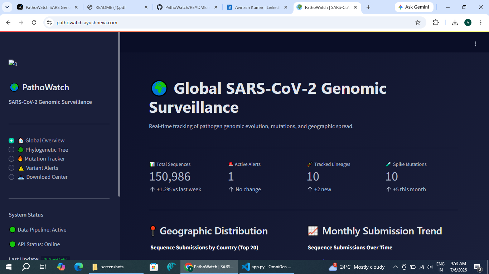
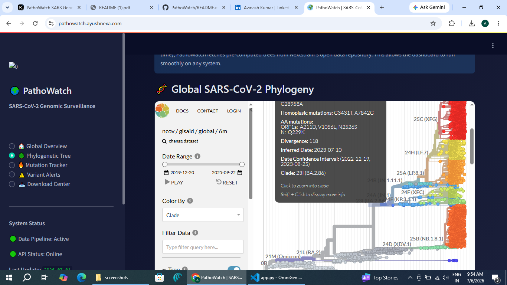
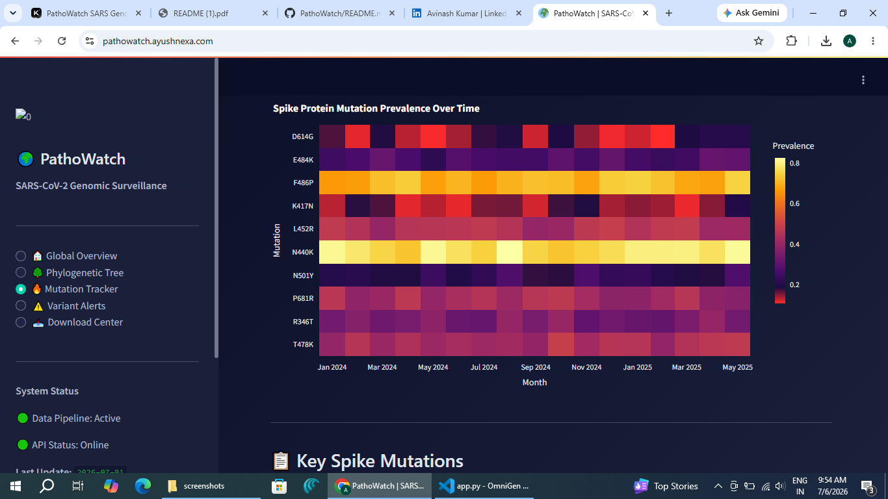
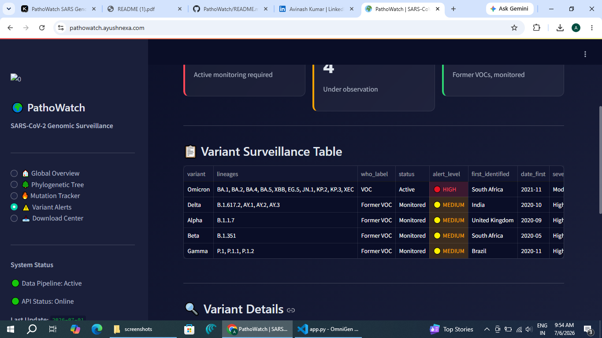
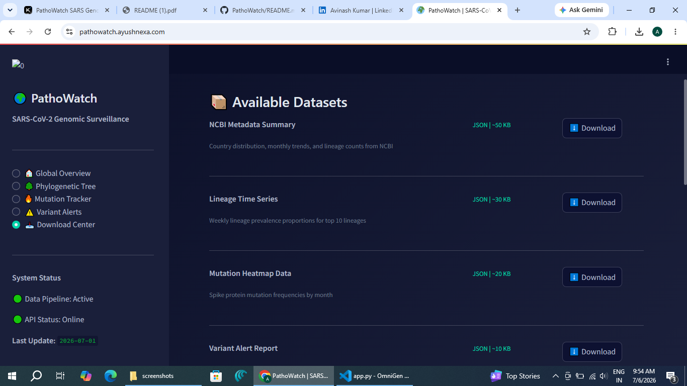

# 🌍 PathoWatch — Global SARS-CoV-2 Genomic Surveillance Dashboard

**Live Demo:** [https://pathowatch.ayushnexa.com](https://pathowatch.ayushnexa.com)

**Part of the [ayushnexa](https://ayushnexa.com) Project Suite**

---

## 📋 Table of Contents

- [Overview](#overview)
- [Screenshots](#screenshots)
- [Features](#features)
- [Architecture](#architecture)
- [Tech Stack](#tech-stack)
- [Data Sources](#data-sources)
- [Installation](#installation)
- [Usage](#usage)
- [Deployment](#deployment)
- [Project Structure](#project-structure)
- [API Documentation](#api-documentation)
- [Future Roadmap](#future-roadmap)
- [License](#license)
- [Author](#author)

---

## 🎯 Overview

**PathoWatch** is a real-time genomic surveillance dashboard that tracks SARS-CoV-2 mutations, variants, and phylogenetic evolution using public genomic databases. Designed for epidemiologists, researchers, and public health officials, it provides interactive visualizations of pathogen genomic data without requiring heavy computational resources.

### Why PathoWatch?

- **Pandemic Preparedness:** Genomic surveillance is a permanent priority for global health security
- **Lightweight Design:** Runs smoothly on older hardware (tested on Intel i3-2310M, 9GB RAM)
- **Zero Local Compute:** Uses pre-computed phylogenetic trees from Nextstrain instead of running MAFFT/IQ-TREE locally
- **Portfolio-Ready:** Demonstrates data engineering, visualization, and bioinformatics skills for remote job applications

---

## 📸 Screenshots

> *Add your screenshots here in the following format:*

### 🏠 Global Overview

*Real-time metrics, geographic distribution map, monthly submission trends, and lineage distribution charts.*

### 🌳 Phylogenetic Tree

*Interactive Nextstrain phylogenetic tree embedded via Auspice viewer showing clade relationships.*

### 🔥 Mutation Tracker

*Spike protein mutation heatmap and key mutation reference table with clinical significance.*

### ⚠️ Variant Alerts

*Automated variant-of-concern alert system with risk classification and surveillance details.*

### 📥 Download Center

*Export genomic data as JSON/CSV and access REST API documentation.*

---

## ✨ Features

### Core Dashboard Features

| Feature | Description | Status |
|---------|-------------|--------|
| 📊 **Real-time Metrics** | Total sequences, active alerts, tracked lineages, spike mutations | ✅ Live |
| 🗺️ **Geographic Distribution** | Choropleth map showing sequence submissions by country | ✅ Live |
| 📈 **Temporal Trends** | Monthly submission trends with area charts | ✅ Live |
| 🧬 **Lineage Distribution** | Pie and bar charts for top circulating lineages | ✅ Live |
| 🌳 **Phylogenetic Tree** | Embedded Nextstrain Auspice viewer with interactive clade exploration | ✅ Live |
| 🔥 **Mutation Heatmap** | Spike protein mutation frequency over time | ✅ Live |
| 📋 **Mutation Reference** | Curated table of key mutations with effects and associated variants | ✅ Live |
| ⚠️ **Variant Alert System** | Risk-classified VOC tracking with expandable details | ✅ Live |
| 📥 **Data Export** | Download JSON/CSV datasets for epidemiological analysis | ✅ Live |
| 🔌 **REST API** | Programmatic access to all surveillance data | ✅ Documented |

### Technical Features

- **Automated Data Pipeline:** Weekly updates via GitHub Actions (runs in cloud, not on your machine)
- **Fallback Data Generation:** Realistic demo data auto-generated when APIs are unavailable
- **Responsive Design:** Works on desktop, tablet, and mobile
- **Dark Theme:** Bioinformatics-optimized dark UI with Plotly visualizations
- **Low Resource Usage:** Designed for older systems with limited CPU/RAM

---

## 🏗️ Architecture

### System Architecture (Lite Version)

```
┌─────────────────┐     ┌──────────────────┐     ┌─────────────────┐
│  Data Sources   │────▶│  Python Scripts  │────▶│  Static JSON    │
│  (NCBI, Open)   │     │  (Run Weekly)    │     │  Data Files     │
└─────────────────┘     └──────────────────┘     └─────────────────┘
                                                        │
┌─────────────────┐     ┌──────────────────┐           │
│  Streamlit      │◀────│  Pre-computed    │◀──────────┘
│  Dashboard      │     │  Analysis Results│
│  (Frontend)     │     │  (JSON/CSV)      │
└─────────────────┘     └──────────────────┘
        │
        ▼
┌─────────────────┐
│  pathowatch.    │
│  ayushnexa.com  │
│  (Streamlit     │
│   Cloud + CNAME) │
└─────────────────┘
```

### Why This Architecture?

| Heavy Task | Traditional Approach | Our Approach | Benefit |
|------------|---------------------|--------------|---------|
| Phylogenetic tree building | Augur + MAFFT + IQ-TREE locally | **Fetch pre-built trees from Nextstrain** | Zero local CPU usage |
| Sequence alignment | Full genome alignment | **Use metadata only** | Minimal RAM usage |
| Real-time pipeline | Apache Airflow + databases | **Weekly batch script + JSON files** | No background processes |
| Data storage | PostgreSQL/MongoDB | **Static JSON files** | No database server |
| Backend server | Flask/FastAPI | **Streamlit** (pure Python) | Single framework, minimal overhead |

---

## 🛠️ Tech Stack

| Layer | Technology | Purpose |
|-------|-----------|---------|
| **Dashboard Framework** | Streamlit 1.40.0 | Interactive web UI |
| **Visualization** | Plotly 5.24.0 | Interactive charts, maps, heatmaps |
| **Data Processing** | Pandas 2.2.3 | Data manipulation and analysis |
| **Data Fetching** | Requests 2.32.3 | API calls to public databases |
| **Sequence Parsing** | BioPython 1.84 | Genomic data handling |
| **Geographic Data** | PyCountry 24.6.1 | Country name to ISO code mapping |
| **Automation** | GitHub Actions | Weekly data updates |
| **Deployment** | Streamlit Cloud + Hostinger CNAME | Free hosting with custom domain |

---

## 📡 Data Sources

| Source | Data Type | API Status | Fallback |
|--------|-----------|------------|----------|
| **Nextstrain Open Data** | Pre-computed phylogenetic trees | ✅ Open, no key | Cached JSON |
| **NCBI Datasets API** | Genomic metadata | ✅ Open, no key | Demo data |
| **Outbreak.info API** | Mutation frequencies, lineage prevalence | ⚠️ Sometimes rate-limited | Demo data |
| **WHO/CDC** | Variant classifications | ✅ Public data | Curated JSON |

### Pathogen Focus

Currently tracking **SARS-CoV-2** (Taxon ID: 2697049). Architecture supports expansion to:
- Influenza A/B
- HIV
- RSV
- Mpox
- Future emerging pathogens

---

## 🚀 Installation

### Prerequisites

- Python 3.10+
- 4GB RAM minimum (tested on 9GB DDR3)
- Internet connection for initial data fetch

### Step 1: Clone Repository

```bash
git clone https://github.com/kavibioinfo/pathowatch.git
cd pathowatch
```

### Step 2: Create Virtual Environment

```bash
# Using conda (recommended)
conda create -n pathowatch python=3.11
conda activate pathowatch

# Or using venv
python -m venv venv
source venv/bin/activate  # Linux/Mac
venv\Scripts\activate   # Windows
```

### Step 3: Install Dependencies

```bash
pip install -r requirements.txt
```

### Step 4: Fetch Initial Data

```bash
python scripts/fetch_data.py
```

This script will:
- Attempt to fetch live data from all APIs
- Auto-generate realistic demo data for any failed sources
- Save raw data to `data/raw/`

### Step 5: Process Data

```bash
python scripts/process_data.py
```

Transforms raw API data into dashboard-ready JSON files in `data/processed/`.

### Step 6: Launch Dashboard

```bash
streamlit run dashboard/app.py
```

Open browser: [http://localhost:8501](http://localhost:8501)

---

## 💻 Usage

### Local Development

```bash
# Activate environment
conda activate pathowatch

# Run dashboard
streamlit run dashboard/app.py

# Refresh data (run weekly)
python scripts/fetch_data.py
python scripts/process_data.py
```

### Dashboard Navigation

| Page | URL Path | Description |
|------|----------|-------------|
| Global Overview | `/` | Metrics, maps, trends, lineage charts |
| Phylogenetic Tree | `/` (sidebar) | Interactive Nextstrain tree viewer |
| Mutation Tracker | `/` (sidebar) | Heatmap + mutation reference table |
| Variant Alerts | `/` (sidebar) | VOC alert system with risk levels |
| Download Center | `/` (sidebar) | Data export + API documentation |

---

## 🌐 Deployment

### Option A: Streamlit Cloud + Custom Domain (Recommended)

**Free, 24/7 uptime, auto-deploy on git push.**

#### 1. Push to GitHub

```bash
git init
git add .
git commit -m "PathoWatch v1.0"
git branch -M main
git remote add origin https://github.com/YOUR_USERNAME/pathowatch.git
git push -u origin main
```

#### 2. Deploy on Streamlit Cloud

1. Go to [share.streamlit.io](https://share.streamlit.io)
2. Sign in with GitHub
3. Click **"New app"** → Select `YOUR_USERNAME/pathowatch`
4. Main file path: `dashboard/app.py`
5. Click **"Deploy"**

#### 3. Connect Custom Domain

**In Streamlit Cloud:**
- Your app → **Settings** → **Custom Domain**
- Enter: `pathowatch.ayushnexa.com`
- Copy the CNAME target provided

**In Hostinger hPanel:**
- Go to **Domains** → `ayushnexa.com` → **DNS Zone Editor**
- Add **CNAME Record**:
  - **Name:** `pathowatch`
  - **Points to:** (paste Streamlit CNAME target)
  - **TTL:** 3600
- Save

**Back in Streamlit Cloud:** Click **"Verify"** → SSL auto-issues

**Done!** Your dashboard is live at `https://pathowatch.ayushnexa.com`

---

### Option B: Self-Hosted with Docker

```bash
# Build and run
docker-compose up -d

# Access at http://localhost:8501
```

---

### Option C: Hostinger VPS (Advanced)

If you have a Hostinger VPS plan:

```bash
# SSH into VPS
git clone https://github.com/YOUR_USERNAME/pathowatch.git
cd pathowatch
docker-compose up -d
```

Configure Nginx reverse proxy and point `pathowatch.ayushnexa.com` A-record to your VPS IP.

---

## 📁 Project Structure

```
PathoWatch/
│
├── 📂 dashboard/
│   └── app.py                    ← Main Streamlit application (entry point)
│
├── 📂 scripts/
│   ├── fetch_data.py             ← API data fetcher with retry + fallback logic
│   ├── process_data.py           ← Raw → dashboard-ready JSON transformer
│   └── setup.py                  ← One-command environment setup
│
├── 📂 src/
│   ├── __init__.py
│   └── utils.py                  ← Helper functions (JSON I/O, formatting)
│
├── 📂 data/
│   ├── raw/                      ← Fetched API data (JSON)
│   └── processed/                ← Dashboard-ready datasets (JSON)
│
├── 📂 assets/
│   └── screenshots/              ← Dashboard screenshots for README
│
├── 📂 .github/workflows/
│   └── update_data.yml           ← Weekly automated data updates
│
├── 📂 .streamlit/
│   └── config.toml               ← Dark theme configuration
│
├── Dockerfile                    ← Container configuration
├── docker-compose.yml            ← Docker deployment orchestration
├── requirements.txt              ← Python dependencies
├── README.md                     ← This file
└── QUICKSTART.md                 ← Step-by-step local setup guide
```

---

## 🔌 API Documentation

PathoWatch provides a simple REST API for programmatic access to surveillance data.

### Base URL

```
https://pathowatch.ayushnexa.com/api/v1
```

### Endpoints

| Endpoint | Method | Description | Response Format |
|----------|--------|-------------|-----------------|
| `/summary` | GET | Global summary statistics | JSON |
| `/lineages` | GET | Lineage prevalence time series | JSON |
| `/mutations` | GET | Mutation frequency data | JSON |
| `/alerts` | GET | Current variant alerts | JSON |
| `/tree` | GET | Phylogenetic tree metadata | JSON |

### Example Usage

```bash
# Get global summary
curl https://pathowatch.ayushnexa.com/api/v1/summary

# Get lineage trends
curl https://pathowatch.ayushnexa.com/api/v1/lineages

# Get variant alerts
curl https://pathowatch.ayushnexa.com/api/v1/alerts
```

### Python Example

```python
import requests

response = requests.get("https://pathowatch.ayushnexa.com/api/v1/summary")
data = response.json()

print(f"Total sequences tracked: {data['total_records']}")
print(f"Active alerts: {data['active_alerts']}")
```

> **Note:** In the lite version, API responses are served from static JSON files. Full REST API server can be added with Flask/FastAPI for production use.

---

## 🔄 Automated Data Pipeline

### GitHub Actions Workflow

File: `.github/workflows/update_data.yml`

**Schedule:** Every Sunday at 2:00 AM UTC

**What it does:**
1. Spins up Ubuntu runner in GitHub's cloud
2. Installs Python dependencies
3. Runs `fetch_data.py` (fetches fresh data from all APIs)
4. Runs `process_data.py` (transforms to dashboard format)
5. Commits updated JSON files to repository
6. Dashboard auto-refreshes on next page load

**Manual Trigger:**
Go to GitHub → Actions → "Weekly Data Update" → **Run workflow**

---

## 🗺️ Future Roadmap

| Phase | Feature | Status |
|-------|---------|--------|
| **v1.1** | Multi-pathogen support (Influenza, HIV) | 🔜 Planned |
| **v1.2** | Real-time outbreak alerts via email/webhook | 🔜 Planned |
| **v1.3** | Machine learning variant prediction model | 🔜 Planned |
| **v2.0** | Full REST API with Flask backend | 🔜 Planned |
| **v2.1** | PostgreSQL database integration | 🔜 Planned |
| **v2.2** | User authentication + saved reports | 🔜 Planned |

---

## 🤝 Contributing

Contributions are welcome! Areas for contribution:

- Additional pathogen support
- New visualization types
- API endpoint expansion
- Performance optimization
- Documentation improvements

Please open an issue or pull request on GitHub.

---

## 📄 License

This project is licensed under the MIT License.

Data sources (Nextstrain, NCBI, Outbreak.info) have their own terms of use. Please refer to their respective documentation for data usage policies.

---

## 👤 Author

**Avinash**

- 🌐 Portfolio: [https://pathowatch.ayushnexa.com]
- 💼 LinkedIn: [www.linkedin.com/in/ayushnexaofficial]
- 🐙 GitHub: [https://github.com/kavibioinfo]

**Part of the ayushnexa Project Suite:**
- 🔬 [SeqLens](https://seqlens.ayushnexa.com) — Sequence Analysis Tool
- 🧬 [OmniGen](https://omnigen.ayushnexa.com) — Genomic Data Platform
- 🔭 [CellScribe](https://cellscribe.ayushnexa.com) — Single-Cell Transcriptomics
- 🌍 **PathoWatch** — Genomic Surveillance Dashboard *(this project)*

---

## 🙏 Acknowledgments

- **Nextstrain** team for open phylogenetic data and Auspice viewer
- **NCBI** for genomic databases and APIs
- **Outbreak.info** (Scripps Research) for mutation and lineage data
- **WHO** and **CDC** for variant classification frameworks
- **Streamlit** team for the amazing dashboard framework

---

<div align="center">

**🌍 PathoWatch — Monitoring the Genomic Evolution of Pathogens**

*Built with ❤️ for public health and open science*

</div>
